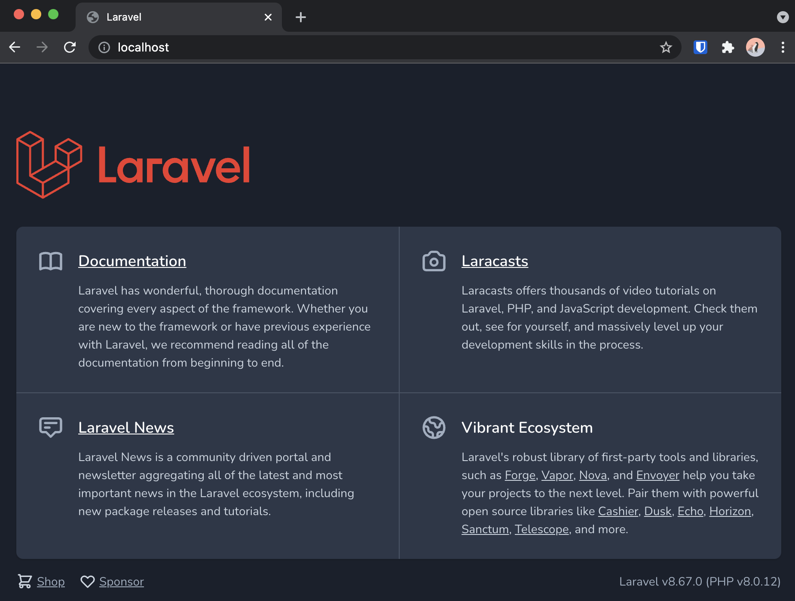

## Installation

Using the following command a new Laravel Project titled **laravel-cms** was created.

```
curl -s "https://laravel.build/laravel-cms" | bash
```

And the application can be run using:

```
cd laravel-cms
```
```
./vendor/bin/sail up
```

This will build a docker container containing the Laravel application.

To avoid having to type in the the command **./vendor/bind/sail** up each time to start the application an alias has been created

```
alias sail='[ -f sail ] && bash sail || bash vendor/bin/sail'
```

The Laravel application can now be viewed at **localhost** in the browser


