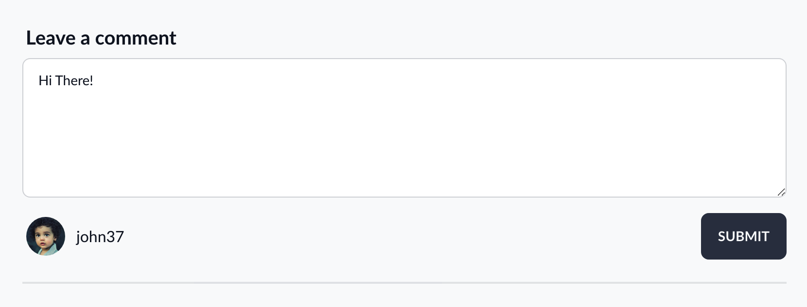
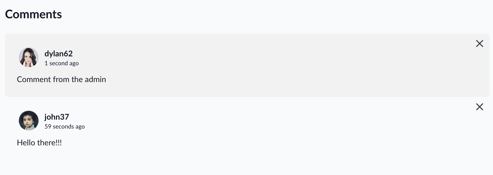
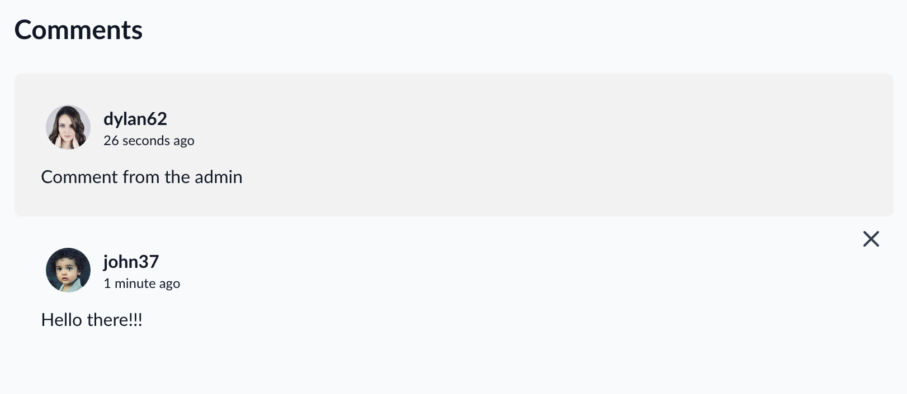

## Model & Migration

Now it's time to create the comments for each post. First I create the Comments Model and a Migration with the following command

```bash
php artisan make:model Comments --migration
```

The migration is fairly simple, it contains the the id of the user and the post it belongs to. 

These foreign keys are also set to CASCADE DELETE meaning if a post or user is deleted all the comments belonging to that entity will be removed

```php
class CreateCommentsTable extends Migration
{
    // ...    
    public function up()
    {
        Schema::create('comments', function (Blueprint $table) {
            $table->id();
            $table->foreignId('user_id')->references('id')->on('users')->onDelete('cascade');
            $table->foreignId('post_id')->references('id')->on('posts')->onDelete('cascade');
            $table->text('text');
            $table->timestamps();
        });
    }
    // ...
}
```

The author and post relationships belongs to relationship are set up in the model.

The `$with` property contains the the author. Meaning all comments will be eager loaded with their parent user entity.

```php

class Comment extends Model
{
    // ...

    protected $fillable = ['user_id', 'text'];

    protected $with = ['author'];


    public function author()
    {
        return $this->belongsTo(User::class, 'user_id');
    }

    public function post()
    {
        return $this->belongsTo(Post::class);
    }

    // ...
}

```

## Controller


The validation logic is set up in the store method. All I need to validate is the comment text and check has been sent with the request and is under 1000 characters.

Due to time constraints, comments can only be created and deleted. However in the future additional markup and functionality could be implemented to allow users to update comments.

```php
class CommentController extends Controller
{

    public function store(Post $post, Request $request)
    {
        $request->validate([
            'text' => 'required|max:2500'
        ]);

        $post->comments()->create([
            'user_id' => $request->user()->id,
            'text' => $request->text
        ]);

        return back();
    }

    public function destroy(Comment $comment)
    {
        $this->authorize('delete', $comment);
        $comment->delete();
        return back();
    }
}
```

The destroy method makes use a policy which will be explained next

## Policy

To allow admins to monitor the site. Any user that has the role of **admin** **editor** and **author** can remove any comment regardless of ownership.

Regular users have the ability to delete their own comments

```php
class CommentPolicy
{
    // ...

    public function before(User $user, $ability)
    {
        if ($user->isAdmin()) {
            return true;
        }
    }

    public function create(User $user)
    {
        return true;
    }

    public function delete(User $user, Comment $comment)
    {
        if ($user->hasRole('author', 'editor')) {
            return true;
        }

        return $user->id === $comment->author->id;
    }
}
```


## Markup

### Form

The form mark uses the `@auth` and `@guest` directives to display different view depending on the users authenticated state.

If the user as logged in the submit button will be enabled and a picture of there username and avatar will be displayed.

If the user is not logged the submit button will be disabled and and message will be displayed notifying the user that they must be logged in to leave a comment

```html
<form action={{route("comments.store", $post)}} method="POST">
    @csrf
    <div class="form-control mb-4 text-xl">
        <label class="label" for="comment">
            <span class="font-bold text-x">Leave a comment</span>
        </label>
        <textarea class="textarea h-36 textarea-bordered" placeholder="Your comment here"
            name="text" id="comment"></textarea>
        @error('text')
        <label class="label">
            <span class="label-text-alt text-base text-error">{{$message}}</span>
        </label>
        @enderror
    </div>
    <div class="flex items-center">
        @auth
        <div class="flex-none flex items-center">
            <div class="avatar mr-2">
                <div class="rounded-full w-10 h-10 m-1">
                    id}}">
                </div>
            </div>
            <p>{{Auth::user()->username}}</p>
        </div>
        @endauth

        @guest
        <p>You must be logged in to leave a comment</p>
        @endguest

        <button class="btn btn-neutral ml-auto" type="submit" {{!Auth::user() ? "disabled" : ""}}>
            Submit
        </button>
    </div>
</form>
```




### Deleting a Comment

To delete comments the a form is embedded in each comment with a delete button. Using the `@can` directive I can display the delete functionality conditionally for each comment.

If user is an admin all the comments will contain a delete button.

If the user is a guest only the comments they own will contain a delete button.

```html
@can('delete', $comment)
    <form action={{route("comments.destroy", $comment)}} method="POST"
        class="absolute right-2 top-2">
        @method("DELETE")
        @csrf
        <button>
            <svg xmlns="http://www.w3.org/2000/svg" class="h-6 w-6 text-neutral fill-current"
                fill="none" viewBox="0 0 24 24" stroke="currentColor">
                <path stroke-linecap="round" stroke-linejoin="round" stroke-width="2"
                    d="M6 18L18 6M6 6l12 12" />
            </svg>
        </button>
    </form>
@endcan
```

Comments for admin user:




Comments for guests:



