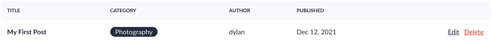
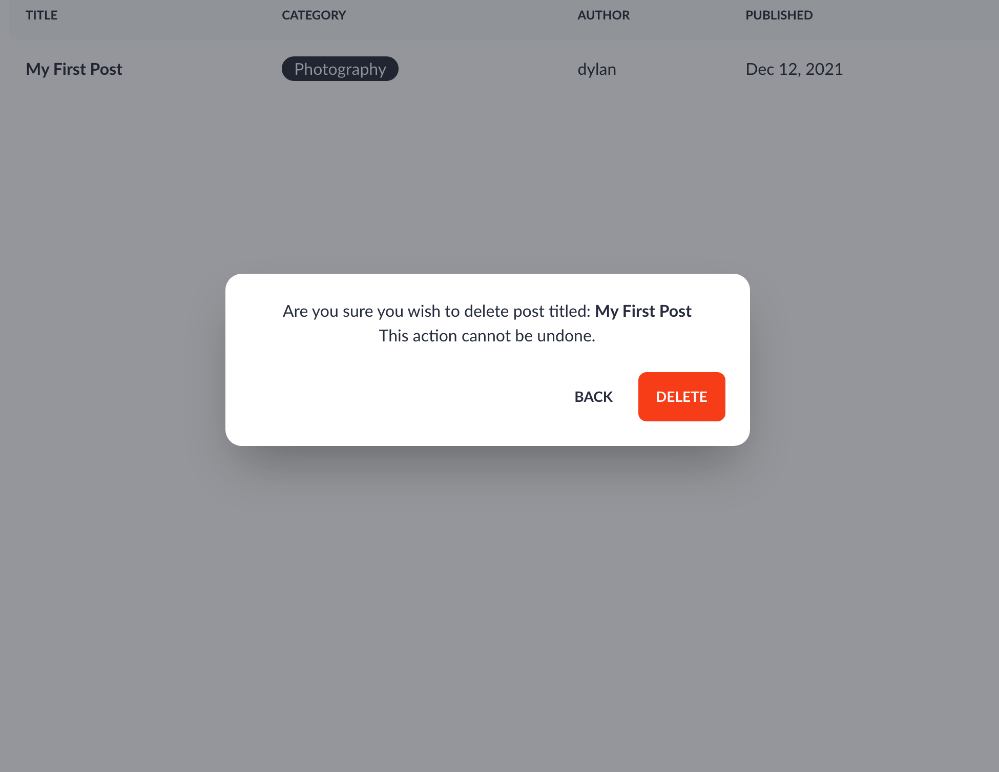

As deleting a post is destructive and permanent, a good UI/UX will implement error prevention allow the user to back track on their decision.

For this I want to implement a modal to would appear every time the user clicked the delete button. For this I used minimal Alpine.js framework laravel provides out of the box

First I created the markup for the modal

```html
<div id="modal" class="modal" :class="show && 'modal-open'" :show="show">
    <div class="modal-box -mt-60">
        <div class="text-center">
            <p>Are you sure you wish to delete post titled: <strong x-text="title"></strong> <br> This action
                cannot be
                undone.
            </p>
        </div>
        <div class="modal-action">
            <button class="btn btn-ghost" @click="close">Back</button>
            <form :action="action" method="POST">
                @method('DELETE')
                @csrf
                <button class="btn btn-error">Delete</button>
            </form>
        </div>
    </div>
</div>
```

As you can there are multiple attributes that will be bound to dynamic data:

- class
- show
- title
- action

Next I create an an alpine object that contains all the data for modal logic.


```html
<!-- resources/views/admin/posts/index.blade.php -->
<script>
document.addEventListener('alpine:init', () => {
    Alpine.data('modal', () => ({
        show: false,
        title: '',
        action: '',

        open(title, id) {
            this.action = `posts/${id}`
            this.title = title;
            this.show = true;
        },

        close() {
            this.show = false;
        }
    }))
})
</script>
```

To understand how this works we take a look at the button element for each post

```html
<button class="link text-accent" @click="open('{{$post->title}}', '{{$post->id}}')">
     Delete
</button>
```

As you can see click the button will call the `open` method and pass the title of post and id of the post.

The open method will then use this id to fill in the action and title for the modal.

It will also set show to true will display the modal on the screen

For example this clicking on the delete button for this post will generate the following markup: 



```php
<div id="modal" class="modal modal-open" :class="show 'modal-open'" :show="show" show="true">
            <div class="modal-box -mt-60">
                <div class="text-center">
                    <p>Are you sure you wish to delete the post titled: <strong x-text="title">My First Post</strong> <br> This action
                        cannot be
                        undone.
                    </p>
                </div>
                <div class="modal-action">
                    <button class="btn btn-ghost" @click="close">Back</button>
                    <form :action="action" method="POST" action="posts/3">
                        <input type="hidden" name="_method" value="DELETE">
                        <input type="hidden" name="_token" value="utuu4fYaxXCXW747UjjQasdSfrrj5IDuYs3BT61h">                        
                    <button class="btn btn-error">Delete</button>
            </form>
        </div>
    </div>
</div>
```

As you can the form data has has been filled with the ID of the post. So when clicking the delete button the post with the id of `3` will be deleted.

This is displayed like this to the user:



