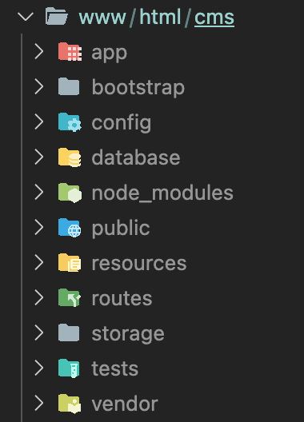
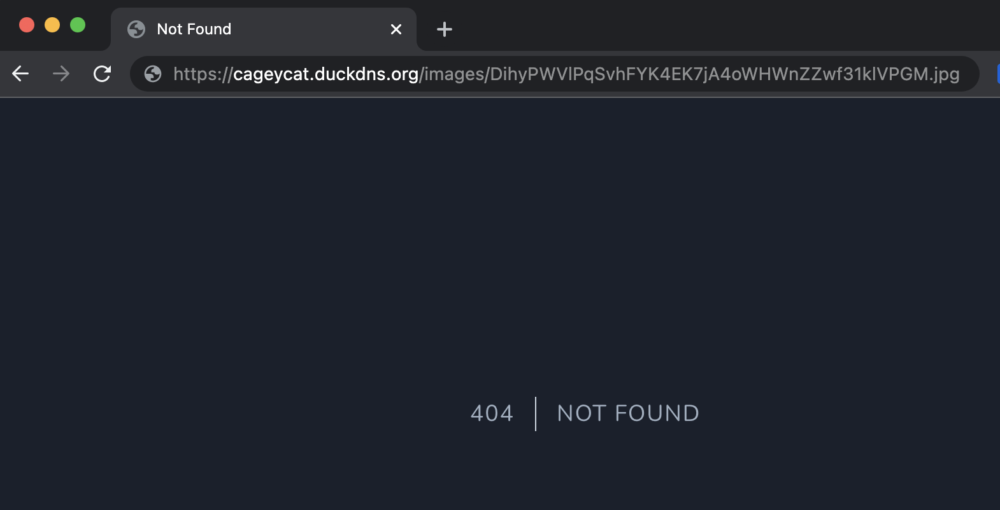
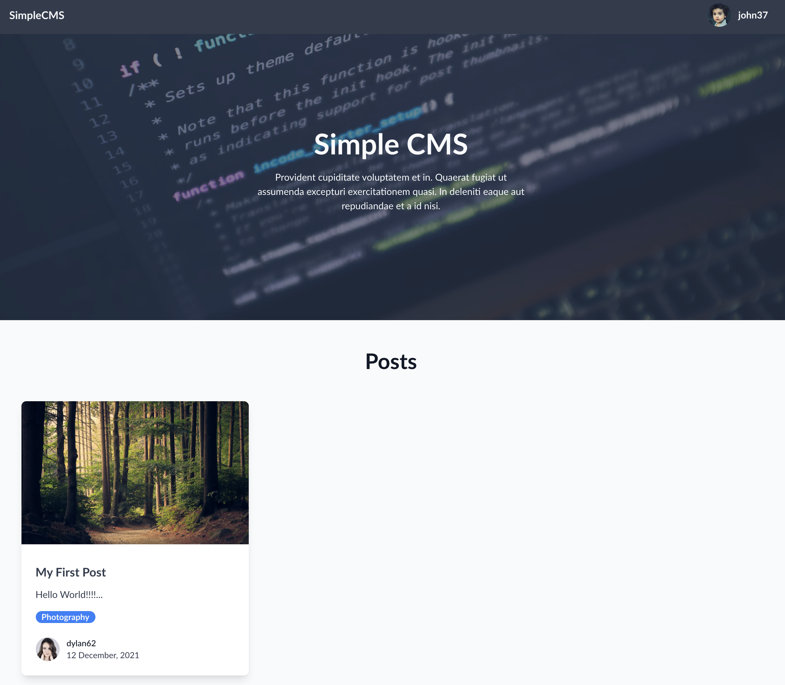

## Configuring apache to server the laravel project

I created an apache web-server using a digital ocean droplet running the LAMP stack on Ubuntu 20.04.

For simplicity I dragged the files from the local development project into the webroot directory `/var/www/html` 



I installed node nodejs and npm

```
sudo apt install nodejs npm
```

I then `npm install` to install all the packages required for laravel breeze and to use laravel mix

Finally I configured the apache default conf file to set the document root the laravel site 


```bash
/etc/apache2/sites-enabled/000-default-le-ssl.conf

<IfModule mod_ssl.c>
<VirtualHost *:443>
        ServerAdmin webmaster@localhost
        DocumentRoot /var/www/html/cms/public

        <Directory /var/www/html/cms>
            Options Indexes FollowSymLinks
            AllowOverride All
            Require all granted
        </Directory>

        ErrorLog ${APACHE_LOG_DIR}/error.log
        CustomLog ${APACHE_LOG_DIR}/access.log combined

        <IfModule mod_dir.c>
            DirectoryIndex index.php index.pl index.cgi index.html index.xhtml index.htm
        </IfModule>


ServerName cageycat.duckdns.org
Include /etc/letsencrypt/options-ssl-apache.conf
ServerAlias www.cageycat.duckdns.org
SSLCertificateFile /etc/letsencrypt/live/cageycat.duckdns.org/fullchain.pem
SSLCertificateKeyFile /etc/letsencrypt/live/cageycat.duckdns.org/privkey.pem
</VirtualHost>
</IfModule>
```

## Teething problems

As with moving from a local to live site there are always teething problems.

The deployment went surprisingly well, The only problem I did encounter was that images would not load.

When taking a further look a 404 response will being returned



I figured this was due the symbolic being broken when moving the files to the live server so I ran the `php artisan storage:link` command and tried again.

But unfortunately, this did not work either. VS Code is very and displays symbolics in the file directory and there was none showing so this command wasn't working.

In the end, to get it working I had to create symbolic link manually

```bash
ln -s /var/www/html/cms/storage/app/public/images /var/www/html/cms/public/images
```

And finally the images worked and the site was live and ready!

