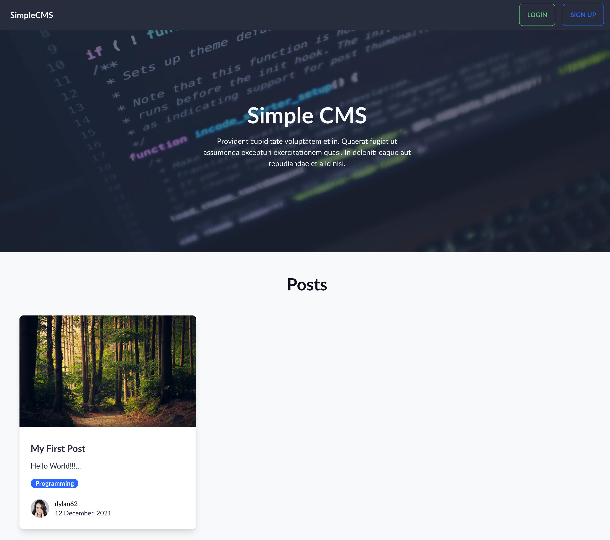
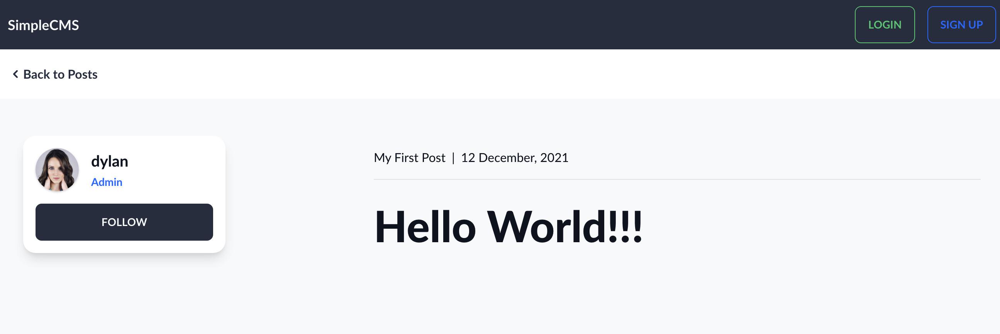
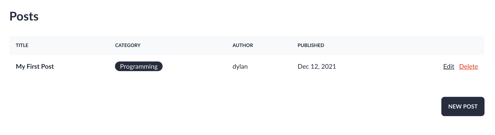
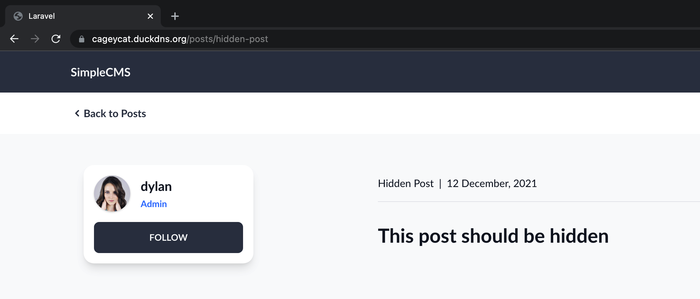

## Displaying Posts

Displaying posts is very simple however how guests and admins interact with posts is very different so I had to create a solution that allowed for the different views to be displayed.

This is why I created two **PostControllers**. one for the guests and one for the admins.

I updated the routing to accommodate for this:

```php
// routes/web.php
Route::get('/', [GuestPostController::class, 'index']);

Route::get('/posts/{post:slug}', [GuestPostController::class, 'show'])->name('posts');

Route::group(['prefix' => 'admin', 'as' => 'admin.', 'middleware' => 'auth'], function () {
    Route::resource('posts', AdminPostController::class);
});
```


## The Guest View

For the guests all I done was retrieve the latests post which had there visibility set to true.

The show method was also simple and just returned the view with all the post information.

```php
// app/Http/Controllers/PostController.php
class PostController extends Controller
{
    public function index()
    {
        return view('posts.index', [
            'posts' => Post::latest()->where('visible', 1)->get()
        ]);
    }

    public function show(Post $post)
    {
        return view('posts.show', ['post' => $post]);
    }
}
```


### Index

The index view looped over each post and filled in the data

```php
@foreach ($posts as $post)
    <div class="flex flex-col overflow-hidden rounded-lg shadow-lg">
        <div class="flex-shrink-0">
            thumbnail->path)}} alt="">
        </div>
        <div class="flex flex-col justify-between flex-1 p-6 bg-white">
            <div class="flex-1">
                <a href="posts/{{$post->slug}}" class="block mt-2 mb-4">
                    <h3 class="text-xl font-semibold text-neutral">{{$post->title}}</h3>
                    <p class="mt-3 text-base text-neutral">{{$post->excerpt}}</p>
                </a>
                <div class="badge badge-secondary font-semibold">{{$post->category->name}}</div>
            </div>
            <div class="flex items-center mt-6">
                <div class="flex-shrink-0">
                    <a href="/users/{{$post->author->username}}">
                        <span class="sr-only">{{$post->author->username}}</span>
                        author->id}}" alt="">
                    </a>
                </div>
                <div class="ml-3">
                    <p class="text-sm font-medium text-neutral-600">
                        <a href="/users/{{$post->author->username}}"
                            class="hover:underline">{{$post->author->username}}</a>
                    </p>
                    <div class="flex space-x-1 text-sm text-neutral">
                        <p>{{ \Carbon\Carbon::parse($post->published_at)->format('j F, Y')}}</p>
                    </div>
                </div>
            </div>
        </div>
    </div>
@endforeach
```




### Show

The show template is done in similar fashion. And results in this view.




## The Admin View

The Admin view is different. This information should be condensed to allow quick and easy access to posts. Also all posts show be displayed regardless of their visibility.

There is no show method for the Admin PostsController, instead if the user clicked on a post to see more detail they would be directed to the edit page.

```php
// AdminControllers/PostController.php
class PostController extends Controller
{

    public function index()
    {
        return view('admin.posts.index', [
            'posts' => Post::latest()->get()
        ]);
    }

    //...

```

Using the blade templates I can then iterate over each post and generate HTML markup

```php
@foreach ($posts as $post)
<tr>
    <td>
        <a href={{route('admin.posts.edit', $post)}} class="font-bold hover:underline">
            {{$post->title}}
        </a>
    </td>
    <td>
        <div class="badge badge-lg">
            {{$post->category->name}}
        </div>
    </td>
    <td>{{$post->author->name}}</td>
    <td>{{$post->created_at->toFormattedDateString()}}</td>
    <td class="text-right">
        <a href={{route('admin.posts.edit', $post)}} class="link mr-2">Edit</a>
        <button class="link text-accent" @click="open('{{$post->title}}', '{{$post->id}}')">
            Delete
        </button>
    </td>
</tr>
@endforeach
```



### One Little Caveat

Just because a post is hidden from the guest view does not mean the user cannot access it. If the user were to know or guess the name of unfinished posts and enter it into the URL it would be shown to them. 



This is a big issue but can be solved through the use of policies.