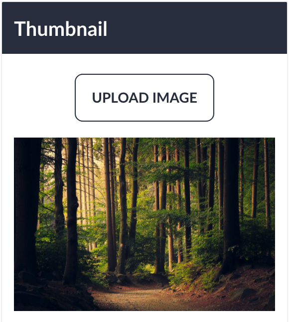

## Uploading Images

Each post would be displayed as card and have a thumbnail associated with it. 

To add this functionality I needed to implement file upload. To begin I first created the Images table.

```php
class CreateImagesTable extends Migration
{
    public function up()
    {
        Schema::create('images', function (Blueprint $table) {
            $table->id();
            $table->foreignId('user_id');
            $table->string('path');
            $table->string('original_name');
            $table->integer('file_size');
            $table->string('mime_type');
            $table->string('alt_text');
            $table->timestamps();
        });
    }
}
```

This table would contain the path to the image and various data relating to the image such as the uploader, file size and alt text.

I then created the Image Model.

All images must be uploaded by a user so I added the belongs method and assigned the User::class. I renamed this to **uploaded_by** as it makes more sense semantically

```php
class Image extends Model
{
    use HasFactory;

    protected $fillable = [
        'path',
        'original_name',
        'file_size',
        'mime_type',
        'alt_text',
    ];

    public function uploaded_by()
    {
        return $this->belongsTo(User::class, 'user_id');
    }
}
```

Before file uploading would work I had to configure **filesystems.php** file to used symbolic links. This would allow me to store my images in the storage but have them be accessible from the public folder of the site.

```php
// config/filesystems.php
'links' => [
    public_path('storage') => storage_path('app/public'),
    public_path('images') => storage_path('app/public/images')
],
```

I then create the symbolic using the command: 

```bash
php artisan storage:link
```

As I only wanted to upload images for posts, I could have the uploading functionality in the PostController. But I wanted a more robust and reusable solution.

This is when i researched various methods and found **traits** in Laravel. Traits allow for reusable code to be injected within controller methods.

So I created a trait that added the functionality for the removal and upload of images.

```php
trait ImageUpload
{
    public function uploadImage($user, $image)
    {
        $image->store('public/images');

        $uploadedImage = $user->images()->create([
            'path' => $image->hashName(),
            'original_name' => $image->getClientOriginalName(),
            'mime_type' => $image->getMimeType(),
            'file_size' => $image->getSize(),
            'alt_text' => '',
        ]);

        return $uploadedImage;
    }

    public function deleteImage(Image $image)
    {
        Storage::delete('public/images/' . $image->path);
        $image->delete();
    }
}
```

The storage of of an image is always proceeded by storing that image in the database.

Image uploads can only be done by authenticated users. All authenticated routes pass down the **$user** and this is then passed into the **uploadImage** method and I can use this to create a image. 

As the Image Model has the **belongsTo** relationship with the **User** I can use the the magic method **images** on the the user to automatically assign the user_id for the **Image** to the **User**.

The removal of the image is always proceeded by removing that image from the database. 

The image is passed down and can be delete using the **Storage::delete** method and the path of the image. The Image can then be removed from the database using the **delete** method.


## Submitting an Image

Now that the business logic of storing and removing Images has created. I still need to submit within the request.

I can do this by adding `enctype='multipart/form-data'` to the form. This allows me to send the form data and files in the same request.

I then add an input of `type=file` to attach the image.

```html
<label for="file-upload" class="btn btn-outline">Upload Image</label>
<input class="hidden" type="file" id="file-upload" name="image">
```

Inputs of type file are notoriously difficult to style. The work around is to hide the input and style the label as the button.


### Image Previews

To improve the UI/UX I want a preview of the image about to be uploaded. I done this by adding an event listener to the file input when it changes.

```html

```

```js
document.getElementById('file-upload').addEventListener('change', (e) => {
    const image = document.getElementById('image');
    image.src = URL.createObjectURL(e.target.files[0]);
    image.onload = () => URL.revokeObjectURL(image.src);
    image.className = "block mt-4";
})
```

Every time the file input changes I update the **src** of the image tag to the file being submitted.

The results ends up like this:




