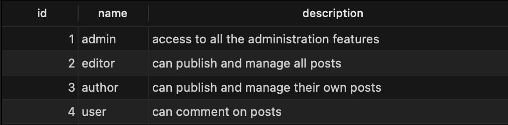
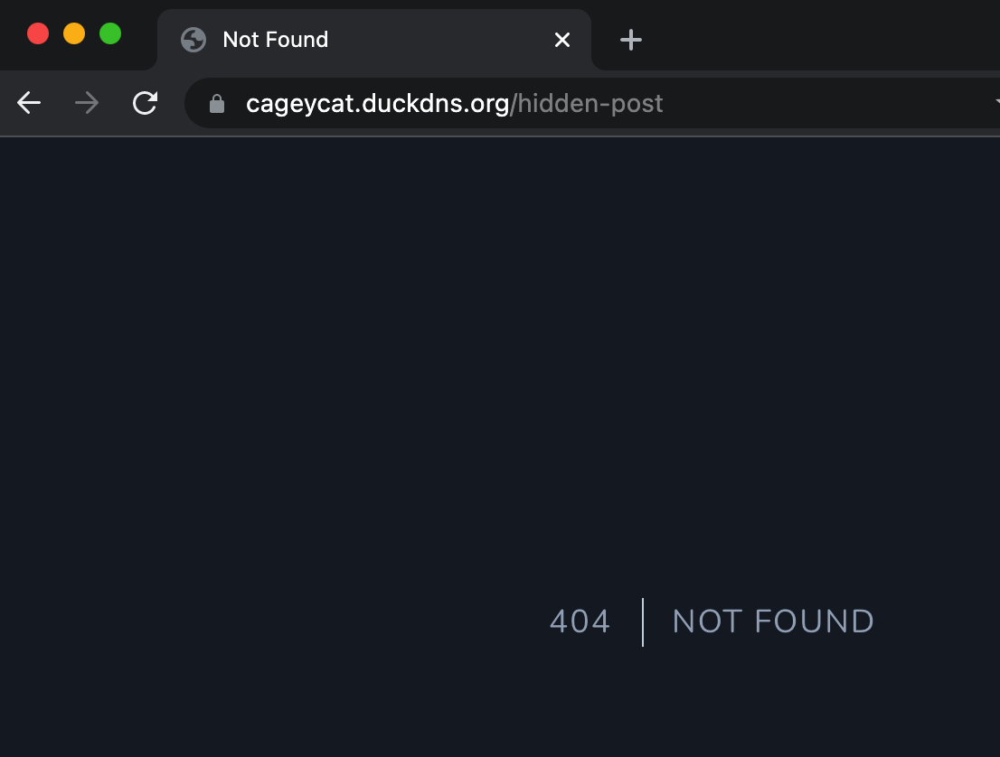

## Roles

Before implementing the Policies. I wanted to create roles for different types of users which will have varying privileges.

First I created the roles table migration

```php
class CreateRoleUserTable extends Migration
{

    public function up()
    {
        Schema::create('roles', function (Blueprint $table) {
            $table->id();
            $table->string('name');
            $table->string('description');
            $table->timestamps();
        });
    }
}
```

I then created the model and assigned a one-to-many relationship


```php
class Role extends Model
{
    public function user()
    {
        $this->hasMany('user');
    }
}
```

I added then added the role_id to user table


```php

class CreateUsersTable extends Migration
{
    public function up()
    {
        Schema::create('users', function (Blueprint $table) {
            $table->id();
            $table->foreignId('role_id')->default(4);
            $table->string('name');
            $table->string('username')->unique();
            $table->string('email')->unique();
            $table->timestamp('email_verified_at')->nullable();
            $table->string('password');
            $table->rememberToken();
            $table->timestamps();
        });
    }
}


```
 
I associated the the User with a role using the **belongsTo** method. I also added various helper functions that will be useful when implementing the validation logic.

```php
class User extends Authenticatable
{
 
    // ...

    public function role()
    {
        return $this->belongsTo(Role::class);
    }

    public function hasRole(...$roles)
    {
        return in_array($this->role->name, $roles);
    }

    public function isAdmin()
    {
        return $this->role->name === 'admin';
    }

    // ...
}
```

The following roles were created: 




## Implementing Policies

Policies are classes that allow the implementation of authorization associated with a particular model. In this case I created a policy for the Post Model

```bash
sail artisan make:policy PostPolicy --model=Post
```

### Fixing the hidden post problem

As you'll remember from earlier, guests could view the details of any posts even if they were set to be hidden.

I fixed this by updating the view method on the post policy. 


```php
// app/Policies/PostPolicy.php
class PostPolicy
{
    // ...
    public function before(User $user, $ability)
    {
        if ($user->isAdmin()) {
            return true;
        }
    }

    public function view(?User $user, Post $post)
    {
        if (optional($user)->hasRole('author', 'editor')) {
            return true;
        }

        if ($post->visible) {
            return true;
        }

        return abort(404);
    }

    // ...
}
```

```php
// app/Http/Controllers/PostController.php
class PostController extends Controller
{
    // ...

    public function show(Post $post)
    {
        $this->authorize('view', $post);

        return view('posts.show', ['post' => $post]);
    }

    // ...
}
```

First the method will check if the user is the admin or has the role author or editor. This means they can access the view regardless of it's visibility.

The before method is run before all authorization checks, this is handy as I can use this to allow the admin to bypass all checks.


If it is visible the policy will allow the request to continue otherwise it will abort and return a 404 response to to the users.





This means even if user somehow manages to guess a title of the post - they will be none the wiser as the receive a 404 not found page.

### Admin Policies

Create, reading and updating can only be done be done with by users with the roles: **admin**, **editor** and **author**.

So I need to add policies to this functionality but first of all I wanted a catch all solution to prevent any other type of user from even reaching these polices.

This is where I created a gate

Gates are similar to policies but Instead they are used more general purposes like routing.

First I defined a gate in the app service provider named admin. This would check if the user had an admin type of role.

```php
class AppServiceProvider extends ServiceProvider
{
    // ...

    public function boot()
    {
        Gate::define('admin', function (User $user) {
            return $user->hasRole('admin', 'author', 'editor');
        });
    }

    // ...
}
```

I then added this gate to routing middleware using the `can:` helper method Laravel provides for gates

```php
Route::group(['prefix' => 'admin', 'as' => 'admin.', 'middleware' => ['auth', 'can:admin']], function () {
    Route::resource('posts', AdminPostController::class);
});
```

This means every route within this group will now use the admin gate before allowing accessing to route. If the user does not have an admin role they server will respond with a **403 Unauthorised** response.

Next it was time to implement the policies for the rest of the Post CRUD

From reading the descriptions of the roles of the database the follow rules apply

1. Admins have access to all functionality
2. Editors can create and manage all posts
3. Authors can create and manage their own posts

This logic was implemented by creating a canUpdateOrDelete method within the PostPolicy


```php
class PostPolicy
{ 
    // ...
    private function canUpdateOrDelete(User $user, Post $post)
    {
        if ($user->hasRole('editor')) {
            return Response::allow();
        }

        if ($user->hasRole('author') && $post->author->id === $user->id) {
            return Response::allow();
        }

        return Response::deny("You do not own this post");
    }
    // ...
}

```

The logic is quite is simple. If the user is an editor allow access. If they are an author and own the post, allow access. Otherwise deny the request.

The method was implemented for Delete and Update methods of the policy.


```php
class PostPolicy
{
    // ...    
    public function create(User $user)
    {
        return true;
    }

    public function update(User $user, Post $post)
    {
        return $this->canUpdateOrDelete($user, $post);
    }

    public function delete(User $user, Post $post)
    {
        return $this->canUpdateOrDelete($user, $post);
    }

    // ...    
}
```

As I'm using the the resource controller for the AdminPostController. I don't have to add the `$this->authorize` on each route instead I can authorize and map each route using the handy `$this->authorizeRoutes` method.

```php
// app/Http/Controllers/AdminControllers/PostController.php
class PostController extends Controller
{
    // ...
    public function __construct()
    {
        $this->authorizeResource(Post::class, 'post');
    }
    // ...
}
```

And with the policies now in place the Post CRUD and authorisation has been completed. Now to move onto comments!