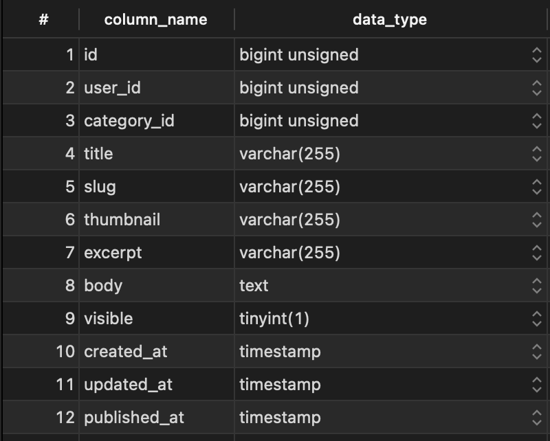
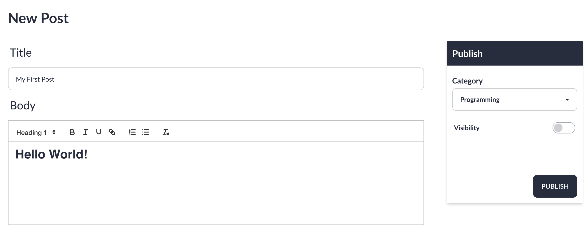
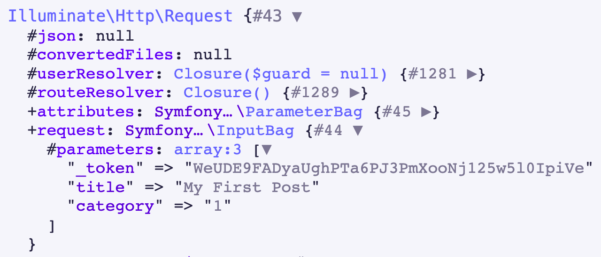
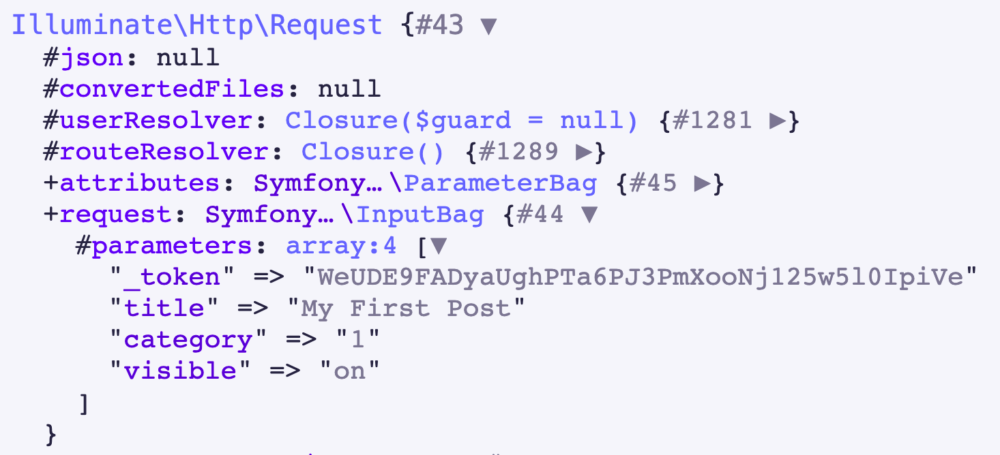
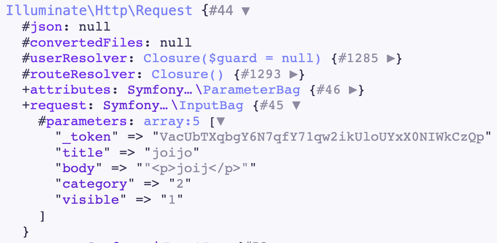

## The Data

As of right now, the post structure looks like this:



Most of this can be retrieved from basic inputs however there's columns that require additional work.

## The View

First of all, when the create route is hit **admin/posts/create** the view containing the post form will be returned. 

The categories have also been queried with the view as they will be required to set the category_id of the post.

```php
// AdminControllers/PostController.php
class PostController extends Controller
{
    public function create()
    {
        return view('admin.posts.create', [
            'categories' => Category::orderBy('name')->get()
        ]);
    }
    
    //...
```

## The Form

From the form I need to retrieve the following data to create a post: **title**, **category**, **body**, **visibility**

Retrieving the title is straightforward and only requires a text input

```html
<input type="text" name="title" id="title" placeholder="Add Title" value="{{old('title')}}" class="input input-bordered {{ $errors->has('title') ? 'input-error' : '' }}">
```

The category_id is retrieved using a select and looping over each category

```html
<select name="category" id="category" class="select select-bordered w-full max-w-xs {{ $errors->has('title') ? 'input-error' : '' }}">
<option disabled="disabled" selected="selected">Select a category</option>
    @foreach ($categories as $category)
    <option value="{{$category->id}}">{{$category->name}}</option>
    @endforeach
</select>
```

visibility is a simple checkbox

```html
<input type="checkbox" name="visible" class="toggle toggle-primary">
```

The body could be retrieved using a textarea but the result would be extremely bland as it only allows text. 

Any blog posting platform worth it's merit would have rich text editor for the formatting of blog content.


### Adding a Rich Text Editor

For the text editor I decided to use Quill.js, this editor is easy to implement and is extremely flexible. 

First I add a div to be used as the editor and give the **id** of editor:

```html
<div id="editor" class="h-80"></div>
```

Then I embed the library and create instantiate the Quill object to initialize the editor:

```html
<!-- resources/views/admin/posts/create.blade.php  -->
<!-- Include the Quill library -->
<script src="https://cdn.quilljs.com/1.3.6/quill.js"></script>

<!-- Initialize Quill editor -->
<script>
    var quill = new Quill('#editor', {
        theme: 'snow',
        modules: {
        clipboard: {
            matchVisual: false
            },
        }
    });
</script>
```

### The Result
 


### Does it work? Not quite

In it's current state, the form looks okay but there's one glaring issue when the form is submitted. 


By using the ddd($request) function I can take a look at the current attributes being sent within the request.



I expected to receive the **title**, **category**, **body**, **visibility**.

However **body** and **visibility** are missing.

### Visibility

The problem with the visibility field is that a comes from a checkbox. The way checkboxes in form submissions work is they only get sent if the checkbox has been checked.

As you can see here, when submitting a post with a checked input I now receive the value: 



The good news is there's a super simple fix for this.

Instead of using one checkbox I can add a hidden input and give it the same name as the checkbox.

Giving the input the same name means only one will be submitted to server 

by default this will be the hidden input unless the checkbox is checked

```html
<input type='hidden' value="0" name="visible">
<input type="checkbox" name="visible" value="1" class="toggle toggle-primary">
```

With this in place, if the checkbox is checked a 1 will be sent otherwise 0 will be sent.


### Body

The problem with body field is the tag used to attach the editor to is a `div` so I can't add a name field to and retrieve the submission that way.

Luckily, Quill.js is aware of this problem a provided an example solution on how to fix this.

First I add a hidden input that will contain the editor content to be submitted

```html
<input name="body" type="hidden">
<div id="editor" class="h-80"></div>N
```

Next inside the script I create an on submit event listener to the form. 

Before the form is submitted I set the value of the hidden input to the contents of the editor.

```js
const form = document.querySelector('form');

form.onsubmit = function(e) {
const body = document.querySelector('input[name=body]');
body.value = JSON.stringify(quill.root.innerHTML);
return true;
};
```

Now when I submit the form, the body attribute will be sent containing the contents of editor.

### Now it's working!




### Computed Properties and Finishing Touches

There's still work to be done here. I need values for the slug of the post and the excerpt of the post. Theses values could considered computed properties as they'll be created from different columns

I could have done this in the PostController **create** method but i'd be duplicating code as I'd to do the exact same processing in the update method. 

This led me look for a solution, I was searching for something like a pre save hook.

This is when I found Observers. Observers allow you to listen to events on a model - Such as it being created or updated.

This is exactly what I needed

I made an Observer for the Post model using the command:

```bash
php artisan make:observer UserObserver --model=User
```

Now I could do some processing to the data before it was saved using the saving method

This code will run on every save event meaning each time a post is created and updated.

```php
class PostObserver
{
    public function saving(Post $post)
    {
        // Create slug from title
        $post->slug = Str::slug($post->title, '-');

        // Strip quotations from quill js submission
        $post->body = substr($post->body, 1, -1);

        // Create excerpt from truncated text
        $post->excerpt = substr(strip_tags($post->body), 0, 55) . "...";
    }
}
```

I created the slug using the title of post and the slug helper method laravel provides

I also noticed the body attribute was being submitted in double quotes which would mess up the formatting when displaying the post so I used the **subtr** method to remove the the first and last characters which were the quotation marks on both ends. 

To create an excerpt I first stripped the html tags from body and then retrieved the first 55 characters. I then concatenated "..." to indicate the text has been truncated.

