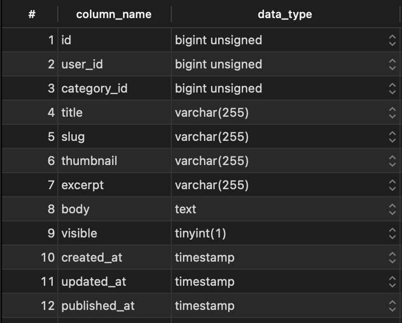
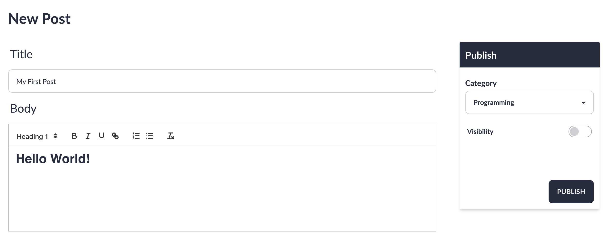
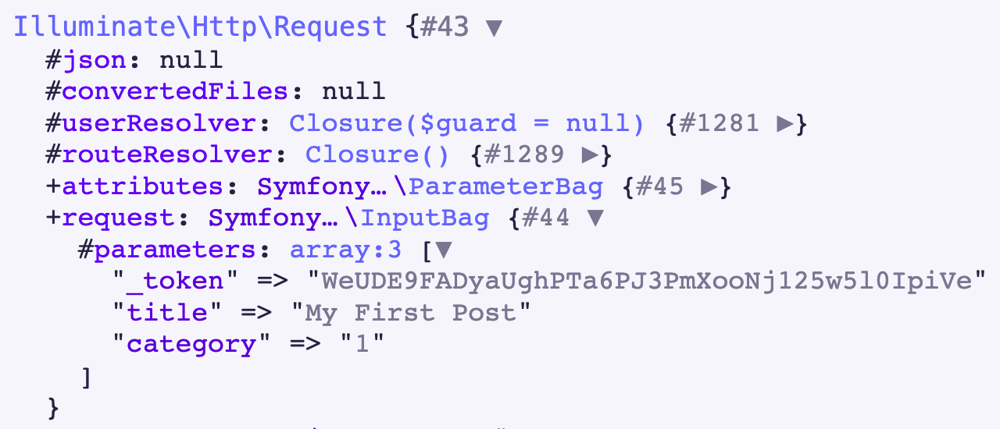

## The Data

As of right now, the post structure looks like this:



Most of this can be retrieved from basic inputs however there's columns that require additional work.

## The View

First of all, when the create route is hit **admin/posts/create** the view containing the post form will be returned. 

The categories have also been queried and return with the view as they will be required to set the `category_id` of the post.

```php
// AdminControllers/PostController.php
class PostController extends Controller
{
    public function create()
    {
        return view('admin.posts.create', [
            'categories' => Category::orderBy('name')->get()
        ]);
    }
    
    //...
```

## The Form

From the form we need to retrieve the following data: **title**, **category**, **body**, **visibility**

Retrieving the title is straightforward and only requires a text input

```html
<input type="text" name="title" id="title" placeholder="Add Title" value="{{old('title')}}" class="input input-bordered {{ $errors->has('title') ? 'input-error' : '' }}">
```

The category_id is retrieved using a select and looping over each category

```html
<select name="category" id="category" class="select select-bordered w-full max-w-xs {{ $errors->has('title') ? 'input-error' : '' }}">
<option disabled="disabled" selected="selected">Select a category</option>
    @foreach ($categories as $category)
    <option value="{{$category->id}}">{{$category->name}}</option>
    @endforeach
</select>
```

visibility is a simple checkbox

```html
<input type="checkbox" name="visible" class="toggle toggle-primary">
```

The body could be retrieved using a textarea but the result would be extremely bland blog posts with no formatting. 

Anyone using a blog platform would expect it to have a rich text editor so that is what we'll have.


### Adding a Rich Text Editor

For the text editor I decided to use Quill.js, this editor is easy to implement and is extremely flexible. 

First add a div to be used as the editor:

```html
<div id="editor" class="h-80"></div>
```

Then embedded the library and creating the Quill object to initialize the editor at the bottom of the view:

```html
<!-- resources/views/admin/posts/create.blade.php  -->
<!-- Include the Quill library -->
<script src="https://cdn.quilljs.com/1.3.6/quill.js"></script>

<!-- Initialize Quill editor -->
<script>
    var quill = new Quill('#editor', {
        theme: 'snow',
        modules: {
        clipboard: {
            matchVisual: false
            },
        }
    });
</script>
```

### The Result
 


### Does it work? Not quite

In it's current state, the form looks okay but there's one glaring issue when the form is submitted. Let's view the request object to see what's going by dumping a request object.



As you can see, we expected to receive the following data: **title**, **category**, **body**, **visibility**.

However **body** and **visibility** are missing.

Let's fix this

### Visibility

The problem with the visibility field is that a comes from a checkbox. The way checkboxes in form submission is they only get sent if the checkbox has been checked.

As you can see here, when submitting a post with a checked checkbox we now receive the value: 


The good news is there's a super simple fix for this

Instead of using one checkbox there's a neat little trick that can be done using two inputs.

Giving the input the same name means only one will be submitted to server 

by default this will be the hidden input unless the checkbox is checked

```html
<input type='hidden' value="0" name="visible">
<input type="checkbox" name="visible" value="1" class="toggle toggle-primary">
```

With this in place if the checkbox is checked a 1 will be sent and 0 will be sent if it is unchecked


### Body

The problem with body field is the tag used to attach the editor to is a `div` so we can't add a name field to and retrieve the submission that way.

Luckily, Quill.js is aware of this problem a provided an example solution on how to fix this.

First we add hidden input that will be used to submit the editor content

```html
<input name="body" type="hidden">
<div id="editor" class="h-80"></div>N
```

Next inside the script we create an submit event listener to the form. From this before the form is submit we extract the contents from the editor and pass them into the value of the input.

Now when we submit the form, the body attribute will sent containing the contents of editor.

```js
const form = document.querySelector('form');

form.onsubmit = function(e) {
const body = document.querySelector('input[name=body]');
body.value = JSON.stringify(quill.root.innerHTML);
return true;
};
```

### Now it's working!


### Computed Properties and Finishing Touches

There's still work to be done here. I need values for the slug of the post and the excerpt of the post. Theses values could considered computed properties as they'll be created from different columns

I could have done this in the PostController create method but i'd be duplicating code as I'd to do the exact processing in the update method. This led me look for a solution, something a 'pre save' hook.

This is where I found Observers, observers all you to listen to events on any modal such as when it is being updated or create and is exactly what i needed

I made an observer an attached it to Post model using the command

```bash
php artisan make:observer UserObserver --model=User
```

Now I could do some processing to the data before it was saved using the saving method


```php
class PostObserver
{
    /**
     * Handle the Post "saving" event.
     *
     * @param  \App\Models\Post  $post
     * @return void
     */
    public function saving(Post $post)
    {
        // Create slug from title
        $post->slug = Str::slug($post->title, '-');

        // Strip quotations from quill js submission
        $post->body = substr($post->body, 1, -1);

        // Create excerpt from truncated text
        $post->excerpt = substr(strip_tags($post->body), 0, 55) . "...";
    }
}
```

This code will run on every save event meaning each time a post is created and updated the following will take place

I created the slug using the title of post and the slug helper method laravel provides

I also noticed the body request was being submitted in double quotes which would mess up the formatting when displaying the elements so I used the subtr method to remove the the first and last characters which were the quotation marks on both ends. 

To create an excerpt I first strip the html tags from body and then retrieve the first 55 characters. I then concatenate "..." to indicate the text has been truncated.

