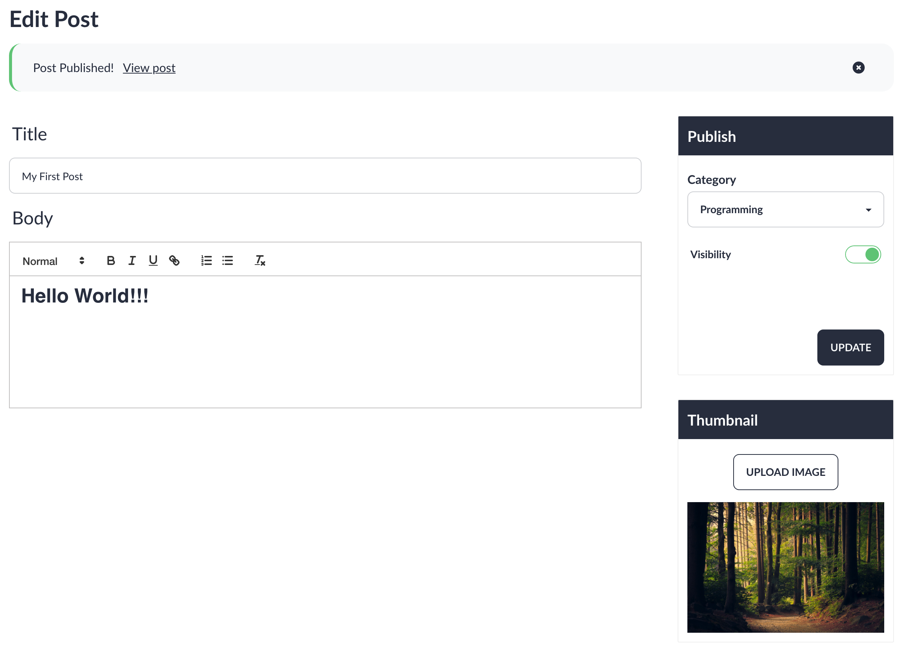

## Almost There

Now that Image upload has been done and the request object has all the required data. It's now time to create the post and save it to the database. But first, I must validate the request to ensure all the required information is sent.

## Validation

Laravel offers built in validation rules and methods to validation requests very simple. I stored the validation in rules as property in the P**ostController** as I'd need to use the same rules for creating and updating.

The validation rules were as follows

```php
// app/Http/Controllers/AdminControllers/PostController.php
private $validationRules = [
        'title' => ['required', 'string', 'unique:posts,title', 'max:255'],
        'body' => ['required', 'string'],
        'category' => ['required', 'exists:categories,id'],
        'image' => ['required', 'image', 'max:2000']
    ];
```

Much of this is self explanatory. 

A notable one being unique which is used to ensure the title attribute is unique in the posts table.

The exists validator which ensures the id being supplied matches a category with that id in the categories table.

## Validation Errors

If the the form data is invalid. The user will be returned back to the same view and there will be an **$errors** variable returned.

I can then check for and access this variable and display the appropriate messages.

For example:

```html
@error('title')
    <label class="label">
        <span class="label-text-alt text-base">{{$message}}</span>
    </label>
@enderror
```

## Storing the Post

Now all that's left is to store the post to database.

```php
public function store(Request $request)
{
    $this->validate($request, $this->validationRules);

    $request->image = $this->uploadImage($request->user(), $request->file('image'));

    $post = $request->user()->posts()->create([
        'title' => $request->title,
        'body' => $request->body,
        'category_id' => $request->category,
        'visible' => $request->visible,
        'thumbnail_id' => $request?->image?->id,
        'published_at' => Carbon::now()
    ]);

    return redirect("admin/posts/$post->id/edit")->with('success', 'Post Published!');
}
```

First I validate the request

Next I upload the image using the uploadImage method. To access the method I must ensure I add the trait to the **PostController** class like so:

```php
class PostController extends Controller
{
    use ImageUpload;

    // ...
```

And then I store the post in the database.

If all this was a success I redirect the user the to Edit page.

To improve the user experience I add a session variable with the key success containing a message for the user.

```html
@if (session()->has('success'))
<div class="alert mb-8 mt-4 border-l-4 border-primary" x-data="{show: true}" x-show="show">
    <div class="flex-1">
        <label class="mx-3">{{session()->get('success')}}</label>
        <p class="block"><a class="link link-info" href={{route("posts", $post->slug)}}>View post</a></p>
    </div>
    <div class="flex-none">
        <button class="btn btn-sm btn-ghost mr-2" @click="show = false"><svg xmlns="http://www.w3.org/2000/svg"
                class="h-5 w-5" viewBox="0 0 20 20" fill="currentColor">
                <path fill-rule="evenodd" d="M10 18a8 8 0 100-16 8 8 0 000 16zM8.707 7.293a1 1 0 00-1.414 1.414L8.586 10l-1.293 1.293a1 1 0 101.414 1.414L10 11.414l1.293 1.293a1 1 0 001.414-1.414L11.414 10l1.293-1.293a1 1 0 00-1.414-1.414L10 8.586 8.707 7.293z" clip-rule="evenodd"
            </svg>
        </button>
    </div>
</div>
@endif
```


## The Result


